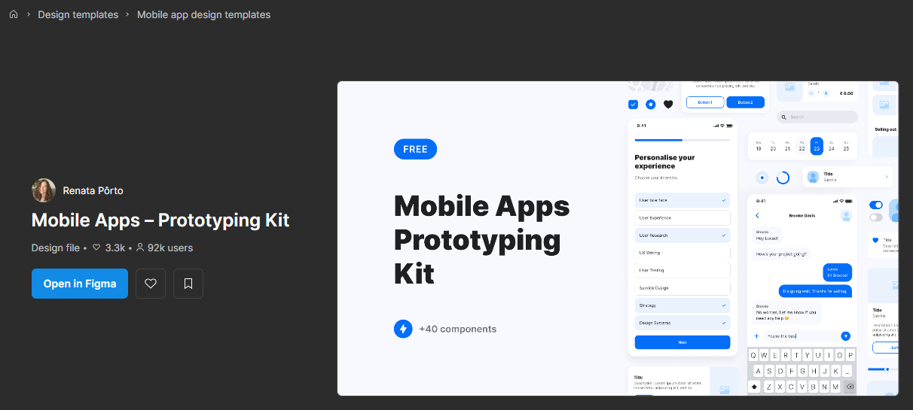
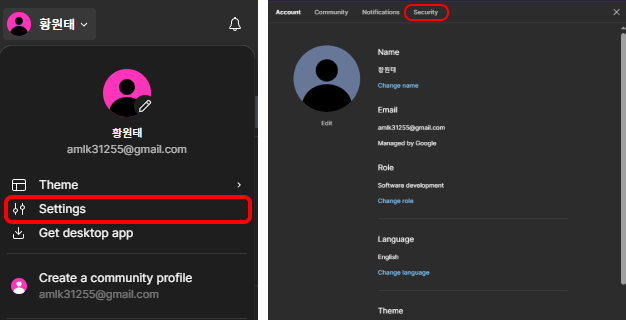
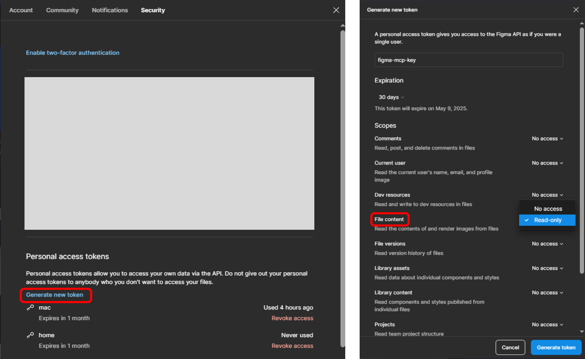
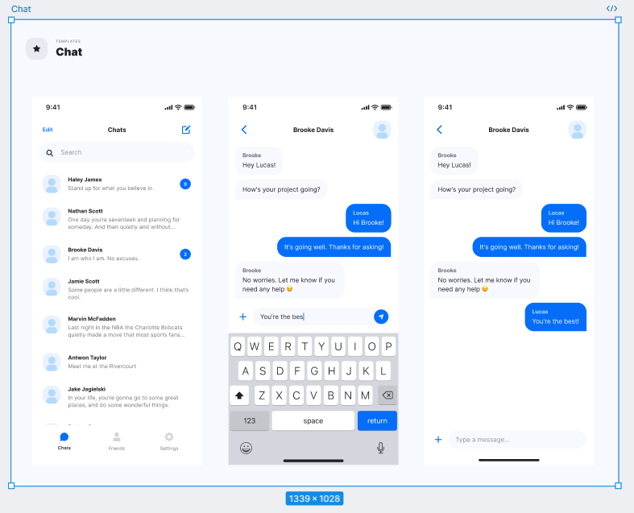
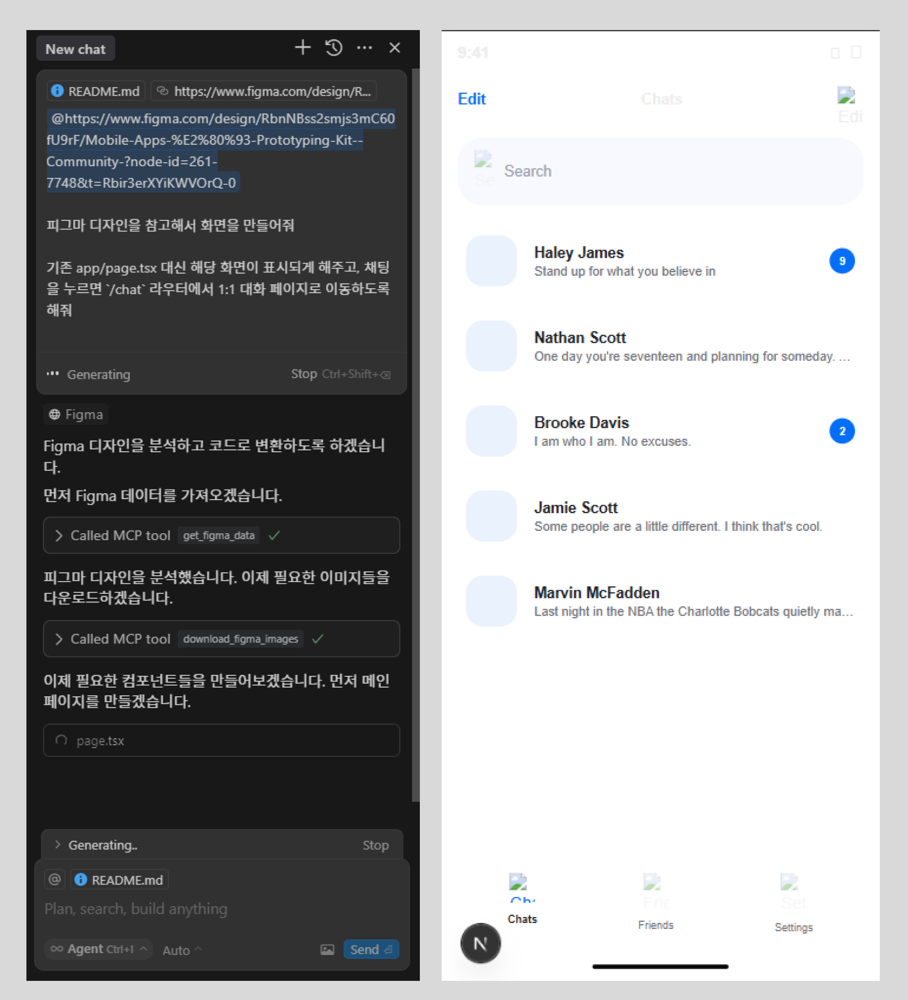
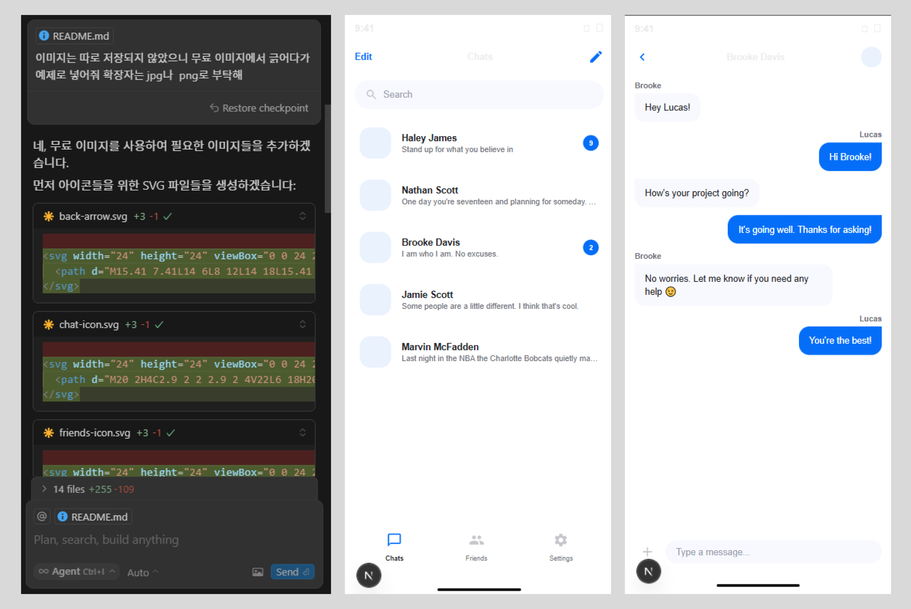

# figma-to-code-mcp

Figma 디자인을 코드로 변환하는 MCP(Model-Controller-Presenter) 아키텍처 기반 프로젝트입니다.

> [[Github] - Figma-Context-MCP](https://github.com/GLips/Figma-Context-MCP) 문서를 참고하여 진행하였습니다.

## 목차
- [figma-to-code-mcp](#figma-to-code-mcp)
  - [목차](#목차)
  - [소개](#소개)
  - [주요 기능](#주요-기능)
  - [기술 스택](#기술-스택)
  - [시작하기](#시작하기)
    - [사전 요구사항](#사전-요구사항)
    - [설치 방법](#설치-방법)
  - [Figma 설정](#figma-설정)
    - [디자인 템플릿 준비](#디자인-템플릿-준비)
    - [AccessToken 생성](#accesstoken-생성)
  - [Cursor MCP 설정](#cursor-mcp-설정)
  - [사용 방법](#사용-방법)
    - [예시 명령어](#예시-명령어)

## 소개

이 프로젝트는 Figma 디자인 파일을 실제 작동하는 코드로 변환하는 과정을 자동화하고 구조화하는 것을 목표로 합니다. MCP 아키텍처를 기반으로 하여 코드의 유지보수성과 확장성을 높였습니다.

## 주요 기능

- Figma 디자인 파일을 React/Next.js 컴포넌트로 자동 변환
- 컴포넌트 단위의 코드 생성
- 반응형 레이아웃 지원
- 라우팅 자동 구성
- 이미지 자동 최적화

## 기술 스택

- Next.js 14+
- TypeScript
- Tailwind CSS
- Figma API
- MCP 아키텍처

## 시작하기

### 사전 요구사항

- Node.js (v14 이상)
- Figma 계정
- Figma API 액세스 토큰
- Cursor 코드 편집기
- 테스트용 Figma 디자인 템플릿

### 설치 방법

```bash
# 프로젝트 생성
npx create-next-app@latest figma-to-code-mcp

# 디렉토리 이동
cd figma-to-code-mcp

# 의존성 설치
npm install
```

## Figma 설정

### 디자인 템플릿 준비

1. [Figma Community](https://www.figma.com/community)에서 원하는 디자인 템플릿을 선택합니다.
2. 본 프로젝트는 [[Figma] Mobile Apps - Prototyping Kit](https://www.figma.com/community/file/1129468881607079432/mobile-apps-prototyping-kit)를 예제로 사용합니다.



### AccessToken 생성

1. Figma 프로필 설정
   - 좌측 상단의 `[프로필]` → `[Settings]` 선택
   - `[Security]` 탭으로 이동
   - `[Generate new token]` 클릭

   

2. 토큰 설정
   - 토큰 이름 설정
   - `[File content]` 권한을 [Read-only]로 설정
   - `[Generate token]` 클릭

   

   > ⚠️ 생성된 토큰은 한 번만 표시되므로 안전한 곳에 보관하세요.

## Cursor MCP 설정

1. Cursor Settings 열기 (`Ctrl + Shift + J`)
2. 좌측 메뉴에서 `[MCP]` 선택
3. `[+ Add new global MCP server]` 클릭
4. `mcp.json` 파일에 아래 설정 추가:

```json
{
  "mcpServers": {
      "Framelink Figma MCP": {
      "command": "cmd",
      "args": [
        "/c",
        "npx",
        "-y",
        "figma-developer-mcp",
        "--figma-api-key=YOUR_ACCESS_TOKEN",
        "--stdio"
      ]
    },
  }
}
```

> ⚠️ `YOUR_ACCESS_TOKEN`을 앞서 생성한 Figma API 토큰으로 교체하세요.

## 사용 방법

1. Figma에서 원하는 디자인 레이어 선택 (`Ctrl + L` 또는 URL 복사)
2. Cursor에서 채팅 열기 (`Ctrl + L`)
3. 복사한 Figma URL 붙여넣기
4. Mode는 `Agent`, Model은 `Auto`로 설정
5. 원하는 변환 작업 요청



### 예시 명령어

**Q1.**
```
{Figma URL} 피그마 디자인을 참고해서 화면을 만들어줘
기존 app/page.tsx 대신 해당 화면이 표시되게 해주고, 채팅을 누르면 /chat 라우터에서 1:1 대화 페이지로 이동하도록 해줘
```

**Q1. 결과물**




**Q2.**
```
이미지는 따로 저장되지 않았으니 무료 이미지에서 긁어다가 예제로 넣어줘 확장자는 jpg나  png로 부탁해
```

**Q2. 결과물**

